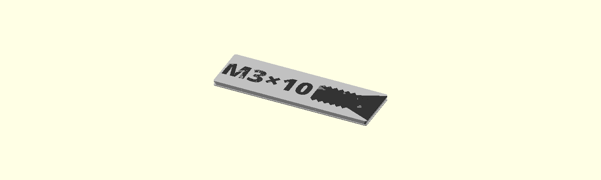
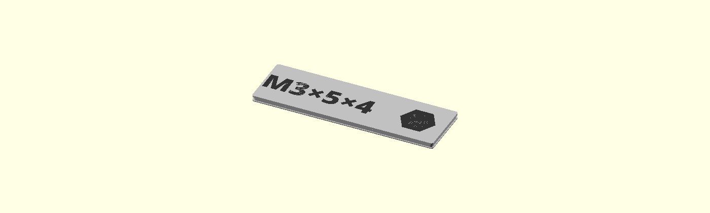

# Gridfinity Label Generator

Generate **multi-color 3MF files** for Gridfinity storage labels -- ready to print with filaments pre-assigned. No manual color setup in Bambu Studio required.

## The Problem

Labeling Gridfinity bins for hardware kits (screws, nuts, inserts) involves a painful workflow:

1. **MakerWorld Customizer** (Cullenect Labels): Enter text one at a time, export one at a time, no multi-color
2. **OpenSCAD locally**: Full control but exports single-color STL/3MF only
3. **gflabel** (`ndevenish/gflabel`): Outputs STEP/STL/SVG -- requires manual "Split to Parts" in Bambu Studio then manual material reassignment per object

This project solves all three: **bulk generation + automatic multi-color 3MF assembly**.

## Examples

| Countersunk Hex Screw | Knurled Insert Nut | Flathead Screwdriver |
|---|---|---|
|  |  |  |

## How It Works

The generator uses a **two-pass OpenSCAD export + Python merge** strategy:

1. **Pass 1 -- Base**: Export the label body (background, fastener icon) as `base.3mf` using `Export_Mode="base"`
2. **Pass 2 -- Text**: Export only the raised text as `text.3mf` using `Export_Mode="text"`
3. **Merge**: Python combines both 3MF files into a single multi-object 3MF with:
   - Two material slots (base color + text color)
   - Bambu Studio metadata for extruder assignments
   - Plate configuration for immediate printing

The OpenSCAD model (`labels.scad`) uses a `label_surface=02` (flush) mode so the text sits perfectly flush with the label surface -- ideal for multi-color printing.

## Quick Start

### Prerequisites

- [OpenSCAD](https://openscad.org/) (installed at default macOS path, or configure in JSON)
- Python 3.10+
- Bambu Studio (for printing)

### Generate All Labels

```bash
python generate_labels.py
```

This reads `labels_config.json` and generates 3MF files to `exports/`.

### Open in Bambu Studio

Open any generated `.3mf` file. Colors are pre-assigned:
- **Filament 1** (slot 1): Label base/body
- **Filament 2** (slot 2): Text and fastener icon

## Usage

### Generate all labels from default config

```bash
python generate_labels.py
```

### Generate a single label

```bash
python generate_labels.py --label M3x10
```

### Test mode (first label only)

```bash
python generate_labels.py --test
```

### Use a different config file

```bash
python generate_labels.py --config labels_m3_countersunk_hex_config.json
```

### Specify output directory

```bash
python generate_labels.py --output exports/MyKit
```

### Generate PNG previews alongside 3MFs

```bash
python generate_labels.py --preview-dir exports/previews/MyKit
```

### Control parallelism

```bash
python generate_labels.py --workers 4
```

## Creating Your Own Config

Each JSON config file defines a hardware kit. Copy an existing config and modify it:

```json
{
  "settings": {
    "openscad_path": "/Applications/OpenSCAD.app/Contents/MacOS/OpenSCAD",
    "output_dir": "exports/MyKit",
    "filaments": {
      "base": 1,
      "text": 2
    }
  },
  "defaults": {
    "fastener_head": "pan",
    "fastener_shaft": "machine",
    "fastener_threads": "full",
    "fastener_driver": "phillips",
    "fastener_orientation": "landscape",
    "fastener_scale": 1.0,
    "font": "Open Sans",
    "font_style": "ExtraBold",
    "font_size": 4.5
  },
  "labels": [
    {"name": "M3x10", "text": "M3\u00d710"},
    {"name": "M3x16", "text": "M3\u00d716", "fastener_scale": 0.85}
  ]
}
```

Per-label overrides take precedence over defaults, so you only need to specify what differs.

## Config Parameter Reference

### Settings

| Parameter | Description | Default |
|-----------|-------------|---------|
| `openscad_path` | Path to OpenSCAD binary | `/Applications/OpenSCAD.app/Contents/MacOS/OpenSCAD` |
| `output_dir` | Output directory for generated 3MFs | `exports` |
| `filaments.base` | Filament slot for label body | `1` |
| `filaments.text` | Filament slot for text/icon | `2` |

### Defaults / Per-Label Overrides

| Parameter | Description | Values |
|-----------|-------------|--------|
| `fastener_head` | Screw head shape | `pan`, `countersunk`, `button`, `hex` |
| `fastener_shaft` | Shaft type | `machine`, `wood`, `self-tapping` |
| `fastener_threads` | Thread coverage | `full`, `partial` |
| `fastener_driver` | Drive type | `phillips`, `hex`, `slot`, `torx` |
| `fastener_orientation` | Icon layout | `landscape`, `portrait` |
| `fastener_scale` | Icon size multiplier | `0.0` - `1.0` (default `1.0`) |
| `show_fastener` | Show fastener icon | `true`, `false` |
| `hardware` | Hardware type (nuts, etc.) | `none`, `nut` |
| `hardware_scale` | Hardware icon size multiplier | `0.0` - `1.0` (default `1.0`) |
| `font` | Text font family | Any font name (bundled: `Open Sans`) |
| `font_style` | Font weight/style | `Regular`, `Bold`, `ExtraBold` |
| `font_size` | Text size in mm | Number (default `4.5`) |
| `text2` | Second line of text | String |

## Comparison

| Feature | This Project | gflabel | MakerWorld Customizer |
|---------|-------------|---------|----------------------|
| Multi-color 3MF output | Yes | No (STEP/STL/SVG) | No |
| Filaments pre-assigned | Yes | No (manual in slicer) | No |
| Bulk generation | Yes (parallel) | Yes | No (one at a time) |
| Custom fastener icons | Yes | Yes | Yes |
| Hardware icons (nuts) | Yes | Limited | Yes |
| Configurable via JSON | Yes | CLI args | Web UI |
| Requires slicer setup | No | Yes (split + reassign) | No (single color) |

## Print Settings

- **Layer height**: 0.2mm
- **Infill**: 10-15%
- **Filament 1**: Label body color (e.g., white, light gray)
- **Filament 2**: Text/icon color (e.g., black, dark gray)
- **Supports**: Not needed
- **Brim**: Optional (labels are small and flat)

## Included Configs

| Config File | Hardware Kit |
|-------------|-------------|
| `labels_config.json` | Mixed M-series screws + knurled nuts |
| `labels_m3_countersunk_hex_config.json` | M3 countersunk hex socket screws |
| `labels_m3_flathead_hex_config.json` | M3 flathead hex socket screws |
| `labels_m3_flathead_screwdriver_config.json` | M3 flathead slotted screws |

## Credits

- **Cullenect Labels** OpenSCAD model by [CullenJWebb](https://makerworld.com/en/models/578922) -- the label geometry and fastener icons
- **Open Sans** font by Steve Matteson (Apache License 2.0)

## License

MIT
